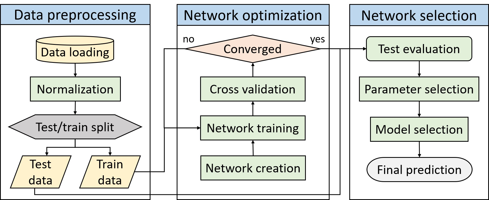

# Predictive modeling and response analysis of spent catalyst bioleaching using artificial neural network
by [Shruti Vyas](https://scholar.google.com/citations?user=15YqUQUAAAAJ&hl=en); [S Das](https://scholar.google.com/citations?user=ujEoYMsAAAAJ&hl=en); [YP Ting](https://scholar.google.com/citations?user=SX4OQ40AAAAJ&hl=en);

#### Repository by [Shruti Vyas](https://scholar.google.com/citations?user=15YqUQUAAAAJ&hl=en)

This is a repository for our Bioresource Technology Reports 2020 paper titled: ["Predictive modeling and response analysis of spent catalyst bioleaching using artificial neural network".](https://www.sciencedirect.com/science/article/pii/S2589014X20300104)

Model training and optimization was performed with Scikit-learn (Pedregosa et al., 2011) and anaconda framework (Anaconda Software Distribution, 2016) was used for code development. 




## Cite

```
@article{vyas2020predictive,
  title={Predictive modeling and response analysis of spent catalyst bioleaching using artificial neural network},
  author={Vyas, Shruti and Das, Subhabrata and Ting, Yen-Peng},
  journal={Bioresource Technology Reports},
  volume={9},
  pages={100389},
  year={2020},
  publisher={Elsevier}
}

```

